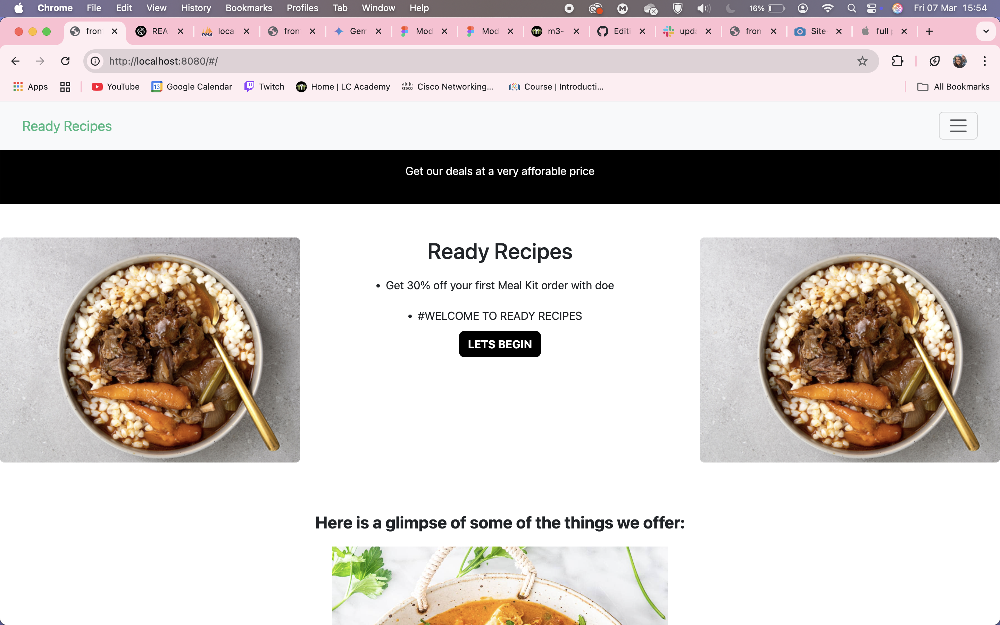

# Ready Recipes E-commerce Website
<div style="display: flex;flex-direction: column; grid-gap: 10px;">
     <div style="display: flex; grid-gap: 10px;">
        
    </div>
</div>
<br>


A fully functional e-commerce website built by Chante Wyngaardt, Bukho Sean Ntlabathi, Rafiek Booysen, and Yandile Matyityilili for the [Course Name] assignment. [Website Name] offers a [A short (1-2 sentence) summary of what the project does and its main purpose].

## Table of Contents
- [Live Demo](#live-demo)
- [Technologies Used](#technologies-used)
- [Setup Instructions](#setup-instructions)
- [Key Features](#key-features)
- [Usage Instructions](#usage-instructions) (Optional)
- [Potential Improvements](#potential-improvements) (Optional)
- [Credits](#credits) (If Applicable)
- [License](#license) (If Applicable)
- [Author](#author)

## Live Demo
[Link to the live deployed website](link/to/live_demo) // tomorrow we will show you how to host

## Technologies Used
- **Front-end:** Vue.js 
- **Styling:** Bootstrap, CSS
- **Back-end:** Node.js
- **Database:** MySQL

## Setup Instructions

Follow these steps to run the ReflectaHome website on your local development environment:

1.  **Prerequisites:**
    * Node.js (v20.18.0)
    * MySQL Server installed and runningg

2.  **Clone the Repository:**
    ```bash
     git clone https://github.com/chantewyngaardt/module-3-project.git
     cd module-3-project
    ```

3.  **Database Setup:**
    * Create a new database named `ready_recipes` in your MySQL server.
    * Import the database schema from the provided SQL file (`ready recipes database.sql`). You can do this using a MySQL client (like phpMyAdmin or MySQL Workbench).
    * Configure the database connection details in your PHP configuration file (e.g., `config.js`, `.env`):
        ```php
        <?php
        // Example configuration
        define('HOST', 'localhost');
        define('USER', 'your_db_user');
        define('PASSWORD', 'your_db_password');
        define('DATABASE', 'reflectahome');
        ?>
        ```

5.  **Web Server Configuration:**
    * Ensure your web server is configured to point to the project's `public` directory (or the main entry point of your application).
    * If using Apache, you might need to enable `mod_rewrite` and configure a `.htaccess` file (if provided).

6.  **Run the Development Server (Example using PHP's built-in server):**
    ```bash
    node --watch inde.js
    ```
    Then, open your web browser and navigate to `http://localhost:3000/`.

## Key Features
This e-commerce website implements the following key features:

* **User Login and Registration:** Secure user registration and login functionality.
* **User Interface Design and UX/UI Principles:** A user-friendly and visually appealing design adhering to UX/UI best practices.
* **Product/Service Display and Catalog Implementation:** Clear and organized display of mirror products with detailed information and browsing capabilities.
* **Shopping Cart and Order Process:** A functional shopping cart allowing users to add, modify, and checkout with their selected items.
* **Responsive Design Implementation:** The website adapts seamlessly to various screen sizes (desktop, tablet, mobile).
* **Database Design and Implementation:** A well-structured database to store user, product, and order data.
* **Authentication and User Management:** Secure authentication for users and potentially an administrative interface for managing the website.
* **Payment System Integration:** A simulated payment gateway.
* **Overall System Integration (Front-end and Back-end):** Seamless communication and data flow between the user interface and the server-side logic.

## Usage Instructions
1. Sign up or login using the existing users
2. Browse Meal Kits or Ready-Made Meals using the links in the navbar
3. Add items to your cart
4. Checkout items by clicking the proceed to cart button
5. Remove items by changing the number of the specific item in your cart
6. Clear the entire cart using the 'clear cart' button

## Potential Improvements
* Advanced search and filtering options.
* User order history.
* Wishlist functionality.
* More sophisticated payment gateway integration.
* Product reviews and ratings.
* Subscription model 

## Credits (If Applicable)
* Bootstrap:(https://getbootstrap.com/docs/5.0/getting-started/introduction/)

## Author
Chante Wyngaardt
chantexwyngaardt@icloud.com
chantewyngaardt
